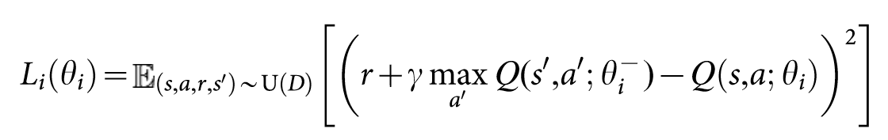
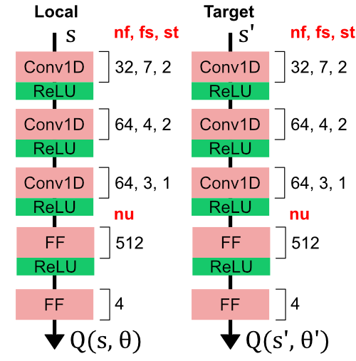
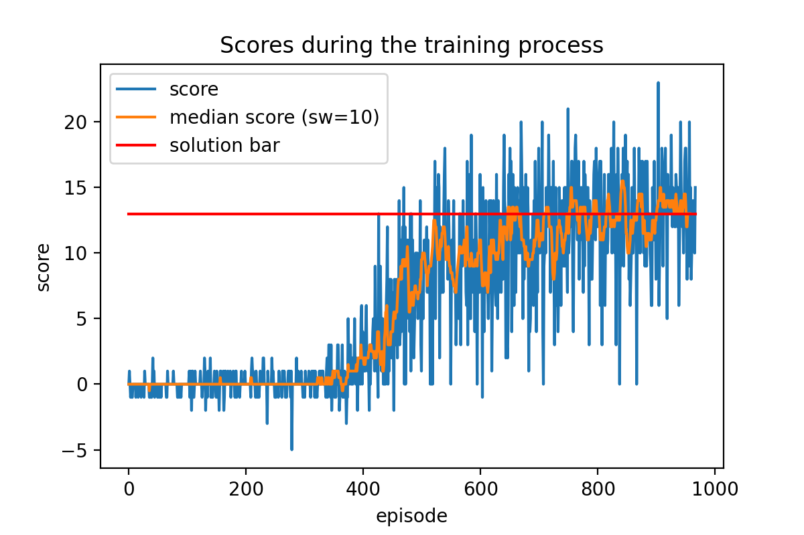

## Introduction
We implemented a Deep Q-Network (DQN) reinforcement learning model as it is presented 
in the paper [Human-level control through deep reinforcement learning](https://web.stanford.edu/class/psych209/Readings/MnihEtAlHassibis15NatureControlDeepRL.pdf) 
with the goal to solve a derivation of the Unity Machine Learning Agents 
([ML-Agents](https://github.com/Unity-Technologies/ml-agents)) Banana Collector environment.

## The Environment
The Environment consists of a bounded 3D world, with randomly spawning banana-like objects,
in which agent can move freely using discrete
set of four actions; namely:
 - move forward
 - move backward
 - turn left 
 - turn right 

The state space is continuous and only partially observable through ray-based perception of objects in the agents field of view.
The observations consist of 37 dimensions including the object perceptions, as well as agents current velocity.

The goal of the agent is to collect as many yellow bananas (reward of +1) while avoiding blue bananas
(reward of -1) as much as possible. The task is episodic and is considered solved when the agent
collects a cummulative reward of more than 13 over 100 subsequent episodes.

## The Agent
The agent is implemented as a typical DQN model based on the [Human-level control through deep reinforcement learning](https://web.stanford.edu/class/psych209/Readings/MnihEtAlHassibis15NatureControlDeepRL.pdf)
which computes state-action values using an arbitrary neural network architecture.
The agent moves through the environment and collects experiences at each step in the form of `(state, action, reward, next_state)`.
These experiences are saved to the replay buffer which holds up to `BUFFER_SIZE` most recent experience vectors.
At each `UPDATE_EVERY` steps, the agent samples `BATCH_SIZE` random experiences and performs a gradient descent optimization
with learning rate `LR` (using Adam optimizer) based on a custom loss function value, which is calculated for a given batch of experiences as:



where `s` is current state, `a` is current action, `r` is reward, `s'` is next state, `γ` is a target discount factor, 
`θ` are trainable parameters of a local network and `θ'` are parameters of a target network.

The local network and target network are two sepparate networks with identical architectures. The local network's parameters
 `θ` are the ones being updated through gradient descent while target network serves as a target value estimator, for which
 the parameters `θ'` are softly updated with multiplier `TAU` from the values of `θ`. This allows for smooth improvement of 
 the target value credibility as the agent learns.

The hyperparameters for the final implementation were set as follows:
 ```
`BUFFER_SIZE = int(1e5)  # replay buffer size
`BATCH_SIZE` = 64        # minibatch size
`GAMMA` = 0.99           # discount factor
`TAU` = 1e-3             # for soft update of target parameters
`LR` = 1e-4              # learning rate
`UPDATE_EVERY` = 4       # how often to update the network
```

### Network architecture
Both the local and the target network have identical architectures, which consist of a sequence of 3 one dimensional convolutional layers
with ReLU activations followed by one feed forward layer (dense) with ReLU activation and finalized by output Feed Forward layer.
The sequence along with the parameters used for each layer is illustrated at the following image:



where `nf` is number of convolution filters (kernels), `fs` is filter (kernel) size, `st` is stride
and `nu` is number of hidden units for feed forward layers. 

## Final results
To solve the environment, the agent must be able achieve average episode score of +13 for 100 consecutive episodes.
Our agent with hyperparameters and network architecture stated in previous chapters was able to solve the environment
in `867` episodes with the average score of `13.05`. The scores for individual episodes are depicted on the following image:



## Future improvements
Our agent gives concrete results but is far from achieving state of the art performance.
Several optimizations may be introduced to implement a more stable and performant agent. 
One might implement a Double Q-Learning architecture in which there are sepparate networks for 
selecting the best action and evaluating the value of the action for a given state. It should also
be beneficial to include Prioritized Experience Replay which helps the agent to learn from
less frequently occuring experiences such as collecting a banana as opposed to experiences of roaming 
around with no reward. Another improvement is to use one network to estimate state values and another
to divulge the advantage of different actions in those states, which is dubbed the Dueling DQN. Based
on a previous research, there is also a considerable benefit to model the outputs of DQN as distributions
over the action values and sample the desired action from these stochastic functions
as opposed to just directly outputing the estimated action values for a given state.